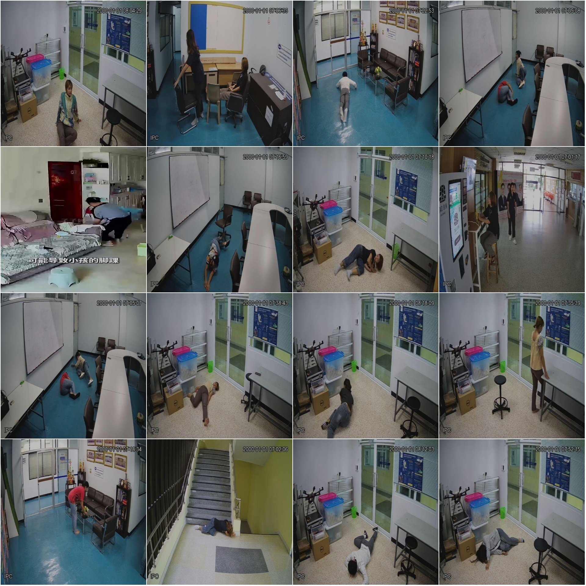
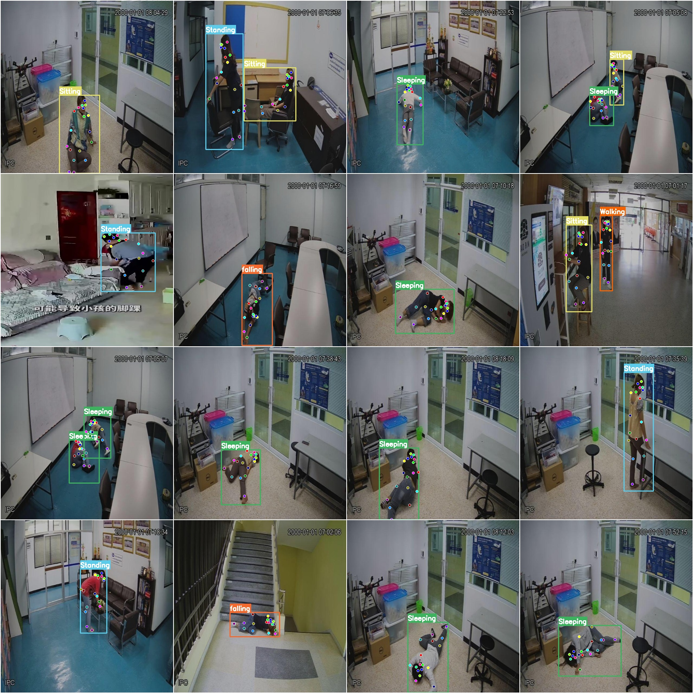

# Human Body Action and Falling Detection Data Set: COCO+YOLO Format with 7770 Images in 6 Classes

Dataset Format: YOLO keypoint format (Note this is not the target detection or segmentation YOLO format, it only contains jpg images and corresponding yolo format txt files).

Number of images (number of jpg files): 7770
Number of annotations (number of txt files): 7770
Training set size: 7270
Validation set size: 500
Test set size: 0
Number of labeled classes: 6
Labeled keypoint count: 18
Keypoints names: ["Nose", "Neck", "R.Shoulder", "R.Elbow", "R.Wrist", "L.Shoulder", "L.Elbow", "L.Wrist", "R.Hip", "R.Knee", "R.Ankle", "L.Hip", "L.Knee", "L.Ankle", "R.Eye", "L.Eye", "R.Ear", 
"L.Ear"]
Number of boxes per class:
Sitting (Seated) = 2000
Sleeping (Lying down) = 2422
Standing (Standing) = 2246
Walking (Walking) = 2570
Waving Hands (Waving Hands) = 96
Falling (Falling) = 2322
Total box count = 11656
Image resolution: 640x640
Important note: The dataset has been divided into training, validation, and test sets that can be directly used for training models using Yolov5-pose, Yolov8-pose, Yolov11-pose, or Yolov26-pose.
Special declaration: This dataset does not guarantee the accuracy of the trained model or weight files.
Image preview:
Annotation example:
Randomly selected 16 images:
Annotation drawing result:

## Images

Here is a pay link on Stripe ( https://buy.stripe.com/3cs8yP7sY87d0vu9AB ). Please contact me lonlonago@foxmail.com after funding $89, and I will send you a complete data files , thank you!

